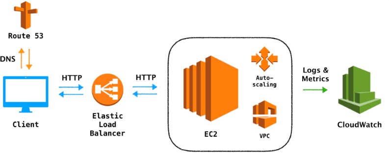

# GetNinjas DevOps Answers. 🚀🚀🚀

## About me

Profissional *formado desde 2009* em **Redes de Computadores**, **Pós-graduado em Banco de Dados (ênfase Oracle)**, *certificado* **LPIC-1**, **LPIC-2**, **LPIC-3**, **ITIL v4**, **DevOps Professional** e **Oracle Cloud Infrastructure - OCI**.

Mais de 10 anos de experiência em administração de sistemas Linux com atuação principal em:
1) **Middleware Jboss/Wildfly/EAP/Community e Tomcat**
2) **Serviços Web - Apache/Nginx/Haproxy**
3) **Storages all flash(Huawei)**
4) **SAN (Storage Area Network)** Rede corporativa de dados voltada para conectar e manter disponíveis servidores e storages via LAN dentro de um ambiente seguro, redundante e de alta performance.
4) **Hypervisor(VsPhere)**<br>

Sou **dinâmico**, **inovador**, **trabalho bem em equipe**, **comunicativo**, **persistente**, **flexível**, **proativo**, tenho alta capacidade para resolver problemas. <br>

Sólidos conhecimentos em **respostas a incidentes** e **investigações técnicas**. <br>

Profissional **aderente a cultura DevOps**, **metodologias ágeis** e **com perfil autodidata**. <br>


## Sobre o teste
Processo seletivo muito 🔝, isso mostra a **qualidade do time**. Cenário desafiador, cheio de possibildades, onde a criatividade e capacidade de desenhar soluções em cloud são cruciais para uma boa entrega.<br>

Gostaria de ratificar que não tenho vasta experiência com os recursos da AWS, detalhe, depois que aprendi a ler minha vida mudou para melhor. Atualmente estou participando de um projeto 


## Cenário
Estamos vivendo em um mundo onde as coisas acontecem em uma velocidade cada vez maior. Obeter vantagens competitivas requer rapidez nas entregas, baixo lead time, altos níveis de serviços e experimentação implacável. <br>

Conforme solicitado, foi criado um fork do projeto https://github.com/getninjas/devops_test e adicionado arquivo de nome **Dockerfile** com o objetivo de empacotar o código disponibilizado na linguagem Golang.

Considerando o nível da aplicação disponibilizada para deploy, além dos requisitos de escalabilidade, billing, segurança, monitoramento e logging , a solução **Elastic BeanStalk** se encaixa perfeitamente, inclusive pela facilidade de implantação permitindo focar no negócio não na tecnologia. 


### Solução Escolhida 
O recurso da AWS escolhido foi o **Elastic BeanStalk** por ser fácil e simples de começar, aumento de produtividade do desenvolvedor, possibilidade de escalar APP baseado em métricas de CPU por exemplo, além de permitir o controle total dos recurso, tipo, alterar o shape da instância EC2 posssibilitando maior workload para o sistema. <br>


>O AWS Elastic Beanstalk é um serviço de fácil utilização para implantação e escalabilidade de aplicações e serviços da web desenvolvidos com Java, .NET, PHP, Node.js, Python, Ruby, Go e Docker em servidores familiares como Apache, Nginx, Passenger e IIS.<br>

>Basta fazer o upload de seu código e o Elastic Beanstalk se encarrega automaticamente da implementação, desde o provisionamento de capacidade, o balanceamento de carga e a escalabilidade automática até o monitoramento da saúde do aplicativo. Ao mesmo tempo, você mantém total controle sobre os recursos da AWS que possibilitam a operação do seu aplicativo e pode acessar os recursos subjacentes a qualquer momento.<br>

>Não há custos adicionais pelo Elastic Beanstalk – você só paga pelos recursos da AWS necessários para executar e armazenar seus aplicativos.

[Documentação AWS](https://aws.amazon.com/pt/elasticbeanstalk/)


## Objetivos

#### 1. Deploy da aplicação na AWS.

**Elastic BeanStalk** - Possibilita o gerenciamento completo de aplicatiovs web. <br>



#### 2. Crie uma forma que possamos subir essa aplicação localmente de forma simples.
Foi Aplicação foi empacotada permitindo maior portabilidade. <br>

Para subir a aplicação basta utilizar o recurso da AWS chamado de Elastic BeanStalk e importar o arquivo Dockerfile file abaixo que está disponível no fork do projeto disponibilzado -> https://github.com/Dionatas/devops_test <br>

**Exemplo do arquivo Dockerfile utilizado no Elastic Bean Stalk**

```
FROM golang

WORKDIR /app

RUN curl -o code.zip -L https://github.com/Dionatas/devops_test/archive/refs/heads/master.zip

RUN apt-get update -y && apt-get install unzip -y

RUN unzip code.zip && cd devops_test-master && mv * ../

ADD . /app

RUN go get github.com/gorilla/mux

EXPOSE 8000

ENTRYPOINT go run main.go

```